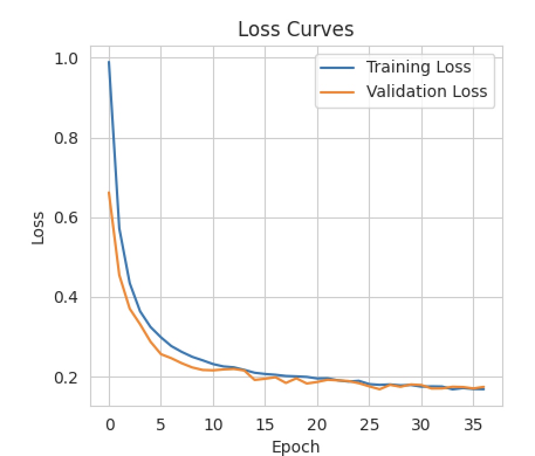
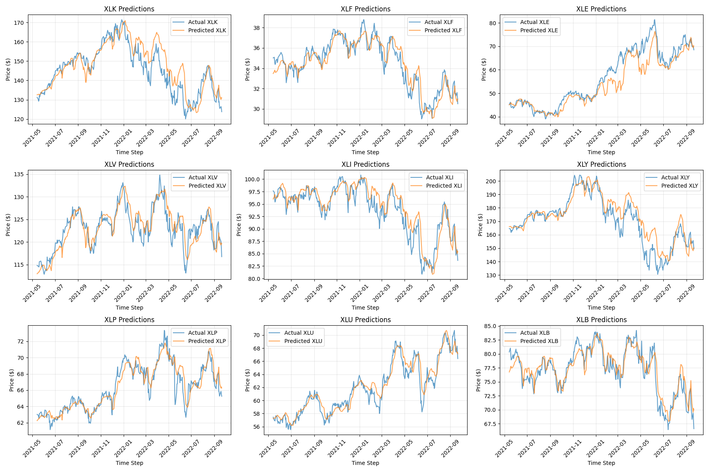
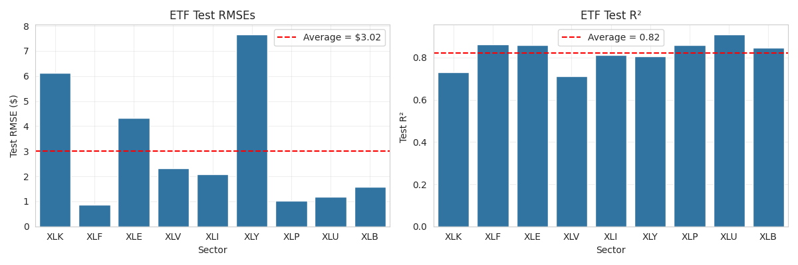

# Predicting Market Sector ETF Prices with a Sequential Neural Network 

Course: Statistics 362 - Advanced Machine Learning

Quarter: Fall 2025

Author: Hayden Sterling

Presentation link: 

---

This is a repository for my STAT 362 Final Project in the Fall 2025 quarter. 

## Problem Description and Dataset

This project seeks to leverage sequential neural networks, specifically the Long Short-Term Memory (LSTM) model, to analyze inter-sector trends and predict the daily price of nine different market sector ETFs. This project accounts for the **interdependency** of markets, or the idea that movements in one market impact outcomes in entirely different markets, by allowing the LSTM to learn relationships between different market sector ETFs and use those relationships to simultaneously predict all nine ETF prices. The specific ETFs used for this model are listed below, and were chosen to incorporate a diverse range of market types. 

1. XLK - Technology Select Sector SPDR Fund
2. XLF - Financial Select Sector SPDR Fund
3. XLE - Energy Select Sector SPDR Fund
4. XLV - Health Care Select Sector SPDR Fund
5. XLI - Industrial Select Sector SPDR Fund
6. XLY - Consumer Discretionary Select Sector SPDR Fund (non-essential goods)
7. XLP - Consumer Staples Select Sector SPDR Fund (essential goods)
8. XLU - Utilities Select Sector SPDR Fund
9. XLB - Materials Select Sector SPDR Fund

In order to account for the fact that investor sentiment affects movements in markets, this project additionally incorporates sentiment-related features extracted from daily news headlines. The sentiment features are passed through the model alongside the financial features, however a baseline model that contains only the financial data is also constructed to compare with the model that includes both financial and news sentiment data. Thus, a secondary goal of this project is to determine the effect (if any) that news headline sentiment exerts on future stock prices. 

The data for this project are taken from two sources. Firstly, the `yfinance` Python package is employed to extract financial data on the above 9 ETFs, including open, high, low, and close prices, as well as stock volumes. This package is imported directly into the Python environment - more information on the package itself can be found  [here](https://pypi.org/project/yfinance/). Secondly, the news headlines are taken from a Kaggle dataset, linked [here](https://www.kaggle.com/datasets/rmisra/news-category-dataset/data). 

## A High-Level Model Description

The news headline sentiment features are extracted from the raw news headlines through [VADER](https://github.com/cjhutto/vaderSentiment) (Valence Aware Dictionary and Sentiment Reasoner), a pretrained sentiment analyis tool that recognizes the emotion and tone of text. A "polarity score" is extracted from each headline, which is a numerical value on the range $[-1,1]$, with values closer to -1 representing headlines with a negative tone and values closer to +1 representing headlines with a positive tone. The three features extracted from the headlines data are: (1) daily average sentiment score (using VADER), (2) daily standard deviation of sentiment scores (using VADER), and (3) the number of headlines in the data for each day (extracted directly from the raw data). These features are passed to the model alongside the financial features (the 4 different price types and volume for all 9 ETFs). 

The model that predicts the close prices is a **stacked LSTM** architecture, combining two LSTM layers sequentially in order to give the model a higher capacity to learn complex, hierarchical features from the data. The model's features are all features for a given sequences of dates - in this case, this is 60 days worth of features. The target is a 9-dimensional vector containing the 9 ETF closing prices on the first day after the end of that particular training sequence. Having the targets be prices on the day after the end of the features sequence prevents any data leakage, as the model only uses data from the past to predict each day's prices. 

The data sequences are passed through the first LSTM layer, and are transformed into both cell states,which stay internal to that layer and represent the layer's long-term memory, and hidden states, which are passed onto the next LSTM layer, which transforms the data in a similar way. The second and final LSTM layer outputs only the hidden state of the last time step, which is inputted into a dense layer with ReLU activation. Finally, a 9-unit linear dense layer computes the 9 predictions. 

Another component of this model is that it employs heavy regularization. Because financial time series, especially stock market data, is extremely noisy, reducing overfitting through regularization is crucial. In the LSTM layers, a combination of recurrent, kernel, and dropout regularization is used with varying strengths. The dense layers use kernel and dropout regularization as well. An Adam optimizer is used with a Huber loss function to further prevent the model from overfitting. Finally, early stopping and adaptive learning rates are used as callbacks in the model to prevent the model from overfitting between training epochs. 

In addition to this LSTM model (which is the main deliverable of this project), a separate model was built that attempted to incorporated a multi-head attention layer after the LSTM layer and before the first dense layer. Attention, which gained popularity through the Transformer architecture, allows sequential models to effectively weight the importance of different components of the input sequences. Ideally, in the context of this model, this would have allowed the LSTM to weigh the parts of the input that have a heavier impact on the output. However, during model evaluation, it became apparent that the inclusion of the attention layer harmed the model, decreasing the model's ability to make accurate predictions. Thus, the LSTM layer without attention is presented as the finalized model. 

## Summary of Key Results 

The model ended its training after 35 epochs due to a plateau in the validation loss. Below is a graph containing two loss curves: training loss and validation loss. 

The loss curves show that the model is effectively learning patterns in the data. There is a sharp decrease in validation loss beteween epochs 1 and 5, indicating that the model is learning significantly during this phase of training. After epoch 15, the learning curve is largely flat, indicating that only incremental progress is being made. The early stopping halting the learning after iteration 35 shows that the model had stopped making significant improvements. Overall, this plot shows that the model learned a relationship between the features and target effectively. 

After validating that this learning occurred, the next step is to evaluate the error (or lack of error) in the model. Firstly, a visual fit for each stock is inspected through the plot below. 

Many of the sectors have well-fitten predictions, such as XLV, XLI, XLP, and XLU. Others have portions of the test data that appear to be well-fitten, but certain portions have clearly incorrect predictions. To further quantify the error of the model, $RMSE$ and $R^2$ have been calculated. $RMSE$ offers an estimate of the error that is given in terms of the original units of the target, dollars. However, $RMSE$ does not provide a good point of comparison between the nine stocks since the nine ETFs have very distinct scales ($RMSE$ values may be vastly different while the relative quality of the predictions may be quite similar). To address this shortcoming, $R^2$ is used as a secondary, scale-independent evaluation metric. 

The results are as follows: 

- Average $RMSE$ across sectors: $3.02
- Average $R^2$ across sectors: 0.82

The model is predicting the ETF prices well, with an average proportion of variance explained of 0.82 ($R^2$). It is important to note that the model predicts some ETF prices much better than others - the maximum $R^2$ is 0.91 (XLU) and the minimum $R^2$ is 0.71 (XLV). Certain markets can be predicted by the given features better than others. 

Other results include the contribution of the sentiment data to the model as well as the model with the attention layer. After creating two models - one that only takes in the financial data and one that takes in both the financial data and the news sentiment data - it becomes evident that the impact of the news sentiment data on the predictions is small and that only some ETFs have show improved predictions as a result of including the sentiment data. This could be due to the fact that all the information contained in the news data is already "priced in" to the current stock price. Creating a model with an attention layer resulted in substantially poorer traning, with the model clearly overfitting. More details on both of these experiments can be found in the presentation. 

## Code Demos

There are two notebooks to run as demos. 

The first is a simple exploration of the data, printing interesting visualizations that motivate the analysis and the model's architecture. To run this demo, open the `notebooks/EDA.ipynb` file. Run the first two code cells to import all libraries and necessary functions into the notebook from the `code/` folder (these may need to be manually imported into the notebook if your environment doesn't recognize the `code/` folder as a package). You may then continue to run the code and see how the sentiment features are extracted along with some visualization. 

The second notebook contains code to run an experiment that allows you to compare the model's performance on the 9 ETFs both before and after including the sentiment features in the data. To run this experiment, open the `notebooks/model_demo.ipynb` and run all cells. Again, you must make sure that the functions are being properly imported from the `code/` folder. 

